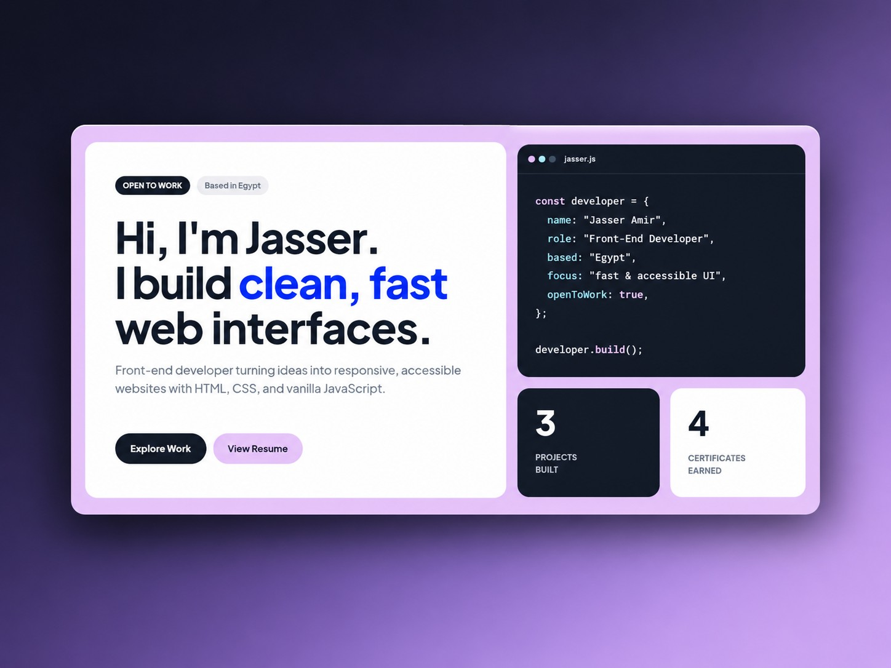

# Jasser Amir — Portfolio



A personal portfolio built from scratch with plain HTML, CSS, and JavaScript. No framework, no build step, no dependencies to install. Projects and certificates are rendered from small data files, and the contact form sends real email through EmailJS.

**Live site:** [jasseramir.github.io](https://jasseramir.github.io)

---

## Highlights

- **Zero build step.** Open `index.html` and it works. Deploys as-is on GitHub Pages.
- **Data-driven content.** Project cards, certificate cards, and the hero counters are generated from `projects.js` and `certificates.js`. Adding an entry needs no HTML changes.
- **Flat, token-based design system.** Pastel palette, no shadows, one typeface. See [DESIGN.md](DESIGN.md).
- **Fully responsive.** Mobile-first layout with a slide-down drawer menu below 768px (tap anywhere or swipe up to close).
- **Accessible by default.** Semantic landmarks, labelled navigation, `aria-expanded` on the menu button, `aria-live` form status, visible focus rings, and `prefers-reduced-motion` support.
- **Custom cursor.** On desktop, a paper-plane cursor that fades to lavender over links and buttons, shows a spinner badge over a disabled button, and turns into an I-beam over text fields. Touch screens keep the native cursor.
- **Scroll reveal animations.** Every block rises from the bottom in 300ms as it scrolls into view, with cards, tiles, and certificates staggered 80ms apart. Powered by ScrollReveal and disabled under `prefers-reduced-motion`.
- **Scroll-spy navigation.** The active link follows the section in view using `IntersectionObserver`.
- **Contact form with spam protection.** EmailJS delivery plus a hidden honeypot field.
- **XSS-safe rendering.** All data-driven strings are HTML-escaped before being injected.
- **SEO ready.** Meta tags, Open Graph, Twitter Card, JSON-LD `Person` schema, canonical URL, and a full favicon set.

---

## Sections

| Section | What it shows |
| --- | --- |
| **Home** | Headline, availability, a flat browser-window illustration, live counters (projects, certificates), resume and project shortcuts |
| **About** | Short bio, approach tags, and the core skills list |
| **Services** | Web Design, Development, Responsive Design |
| **Projects** | Cards with live demo and repository links |
| **Certificates** | Verified credentials with issuer, date, and a link to each certificate |
| **Contact** | EmailJS form, LinkedIn, and GitHub |

---

## Tech Stack

| Technology | Purpose |
| --- | --- |
| HTML5 | Semantic structure |
| CSS3 | Custom properties, Grid, Flexbox, media queries |
| JavaScript (ES6+) | Rendering from data, menu, scroll-spy, scroll reveal, form handling |
| [ScrollReveal](https://scrollrevealjs.org/) v4 | Scroll-in animations, bundled locally in `assets/js/main/scrollreveal.min.js` |
| [EmailJS](https://www.emailjs.com/) | Client-side email sending, loaded from jsDelivr |
| [Plus Jakarta Sans](https://fonts.google.com/specimen/Plus+Jakarta+Sans) | Typeface, loaded from Google Fonts |

Icons are inline SVGs styled by a single rule in the stylesheet, so there is no icon library to load.

---

## Project Structure

```
.
├── index.html
├── favicon.ico
├── README.md
├── DESIGN.md
├── .prettierrc
└── assets/
    ├── css/
    │   └── styles.css            # Tokens, layout, components, responsive rules
    ├── js/
    │   ├── data/
    │   │   ├── projects.js       # Project cards data
    │   │   └── certificates.js   # Certificate cards data
    │   └── main/
    │       ├── scrollreveal.min.js  # ScrollReveal library
    │       └── main.js           # Menu, scroll-spy, cursor, rendering, reveal animations, contact form
    ├── img/
    │   └── logos/                # Favicons, Apple touch icon, social preview
    └── docs/
        └── jasser_amir_resume.pdf
```

Script order matters. `index.html` loads EmailJS, then `projects.js`, then `certificates.js`, then `scrollreveal.min.js`, then `main.js`, because `main.js` reads the `projects` and `certificates` globals and the `ScrollReveal` global.

---

## Getting Started

```bash
git clone https://github.com/jasseramir/jasseramir.github.io.git
cd jasseramir.github.io
```

Open `index.html` directly, or serve it locally:

```bash
python -m http.server 3000
# then visit http://localhost:3000
```

The VS Code **Live Server** extension also works.

---

## Adding a Project

Edit `assets/js/data/projects.js` and add an object to the `projects` array:

```js
{
  projectLink: 'https://example.com/',     // live demo URL, or null if there is none
  projectType: 'Website',                  // short label shown as a pill
  projectTitle: 'Project Name',
  projectDescription: 'One or two sentences about the project.',
  projectGithubSrc: 'https://github.com/username/repo',
}
```

- With a `projectLink`, the card shows **Live Demo** and **View Repository** buttons.
- With `projectLink: null`, the card shows a single **View Repository** button.
- Card colors rotate automatically (white, sky, lavender), and the **Projects Built** counter updates on its own.

## Adding a Certificate

Edit `assets/js/data/certificates.js` and add an object to the `certificates` array:

```js
{
  organization: 'Issuer name',
  certificateTitle: 'Certificate Title',
  dateDay: '1',
  dateMonth: 'Jan',                        // month as a short word, not a number
  dateYear: '2026',
  certificateLink: 'https://link-to-certificate.com',
}
```

The **Certificates Earned** counter and the "issued by" line in the section header are derived from this array.

---

## Contact Form Setup

The form uses [EmailJS](https://www.emailjs.com/) and needs no backend.

1. Create an EmailJS service and an email template.
2. In the template, use these variables, which match the form field names: `user_name`, `user_email`, `user_subject`, `user_message`.
3. Put your service ID, template ID, and public key in the `emailjs.sendForm(...)` call in `assets/js/main/main.js`.

An EmailJS public key is designed to be exposed in client-side code. To limit abuse, restrict the allowed domains and set a rate limit in the EmailJS dashboard.

---

## Code Style

Formatting is handled by Prettier with the settings in `.prettierrc` (semicolons, single quotes, 2-space indent).

---

## License

This project is not licensed for reuse or redistribution.

---

## Contact

- **LinkedIn:** [linkedin.com/in/jasser-amir-37428a3b1](https://www.linkedin.com/in/jasser-amir-37428a3b1)
- **GitHub:** [github.com/jasseramir](https://github.com/jasseramir)
- **Email:** through the contact form on the [live site](https://jasseramir.github.io/#contact)
